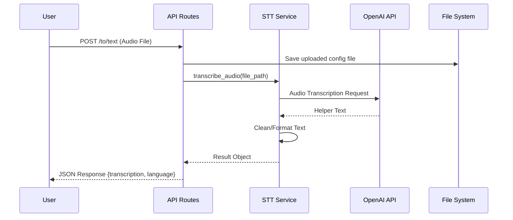
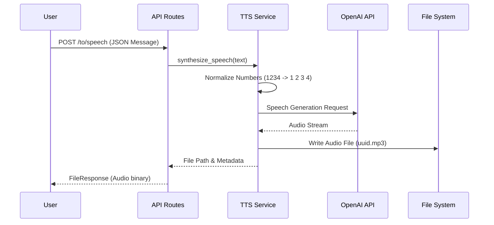

# Speech API Microservice

Este microservicio proporciona funcionalidades de conversión de **Voz a Texto (Speech-to-Text / STT)** y **Texto a Voz (Text-to-Speech / TTS)** utilizando la API de OpenAI. Está construido con **FastAPI** y diseñado para integrarse como un componente modular en una arquitectura de servicios bancarios.

## 📂 Estructura del Sistema de Archivos

```txt
speech_api/
├── .env                  # Variables de entorno (configuración)
├── .gitignore            # Archivos ignorados por git
├── requirements.txt      # Dependencias del proyecto
├── src/                  # Código fuente principal
│   ├── api/              # Definición de rutas y endpoints
│   │   └── routes/       # Routers individuales (health, stt, tts)
│   ├── core/             # Configuración core y utilidades
│   │   ├── config/       # Pydantic settings
│   │   └── logger.py     # Configuración de logging
│   ├── files/            # Almacenamiento temporal de archivos
│   │   ├── generated/    # Archivos de audio generados (TTS)
│   │   └── received/     # Archivos de audio recibidos (STT)
│   ├── models/           # Modelos Pydantic de datos
│   ├── services/         # Lógica de negocio e integración con OpenAI
│   └── main.py           # Punto de entrada de la aplicación
└── README.md             # Documentación del proyecto
```

## 🚀 Funcionalidades

### 1. Speech-to-Text (STT)
Convierte archivos de audio recibidos en texto plano.
-   **Procesamiento**: Recibe un archivo de audio (mp3, wav, etc.), lo guarda temporalmente y lo envía a la API de `transcriptions` de OpenAI.
-   **Limpieza**: El texto resultante se limpia de ciertos caracteres numéricos residuales no deseados.
-   **Modelo**: Configurable (por defecto `whisper-1`).

### 2. Text-to-Speech (TTS)
Convierte texto en un archivo de audio hablado.
-   **Normalización**: Incluye una lógica específica para "normalizar" números: las secuencias largas de dígitos (4 o más) se separan con espacios para que se dicten dígito por dígito (ej. "1234" -> "1 2 3 4"), mientras que los números cortos se leen naturalmente.
-   **Generación**: Utiliza la API de `speech` de OpenAI.
-   **Salida**: Genera un archivo de audio en el servidor y devuelve la ruta y metadatos para su descarga o reproducción.

## 🛠️ Prerrequisitos e Instalación

1.  **Python 3.10+**
2.  **OpenAI API Key**

### Instalación

```bash
# Crear entorno virtual
python -m venv .venv
source .venv/bin/activate  # En Windows: .venv\Scripts\activate

# Instalar dependencias
pip install -r requirements.txt
```

### Configuración (.env)
Crea un archivo `.env` en la raíz basado en el siguiente ejemplo:

```ini
# Server
SERVER_NAME="Speech API"
SERVER_VERSION="1.0.0"
PORT=8000
ENVIRONMENT="dev"

# Logging
LOG_LEVEL="INFO"
LOG_TO_FILE=False

# Identificados
OPENAI_API_KEY="sk-..."

# API
API_PREFIX="/api/v1"

# Defaults STT
STT_DEFAULT_MODEL="whisper-1"
STT_DEFAULT_LANGUAGE="es"
STT_DEFAULT_RESPONSE_FORMAT="text"

# Defaults TTS
TTS_DEFAULT_MODEL="tts-1"
TTS_DEFAULT_VOICE_TYPE="alloy"
TTS_DEFAULT_SPEED=1.0
TTS_DEFAULT_RESPONSE_FORMAT="mp3"
```

## ▶️ Ejecución

Para iniciar el servidor de desarrollo:

```bash
uvicorn src.main:app --host 0.0.0.0 --port 8000 --reload
```
O ejecutando el módulo si está configurado:
```bash
python src/main.py
```

## 📡 API Endpoints

Documentación interactiva disponible en: `http://localhost:8000/docs`

### Health Check
-   **GET** `/api/v1/health`
-   Verifica que el servicio esté operativo.

### Transcribir Audio (STT)
-   **POST** `/api/v1/to/text`
-   **Body (Multipart)**: `audioFile` (Binary)
-   **Respuesta**:
    ```json
    {
      "transcription": "Texto transcrito del audio...",
      "language": "es"
    }
    ```

### Sintetizar Voz (TTS)
-   **POST** `/api/v1/to/speech`
-   **Body (JSON)**:
    ```json
    {
      "message": "Texto que quieres convertir a audio"
    }
    ```
-   **Respuesta**: Archivo de audio (stream/descarga) `audio/mpeg`.

## 📊 Diagramas de Flujo (Mermaid)

### Flujo Speech-to-Text (STT)



### Flujo Text-to-Speech (TTS)


